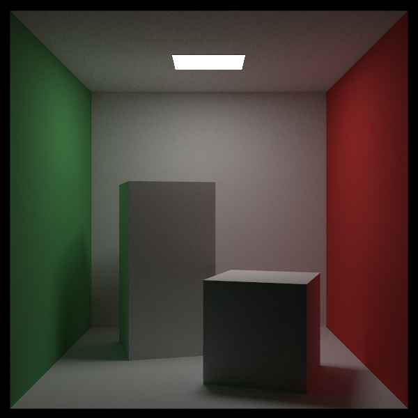
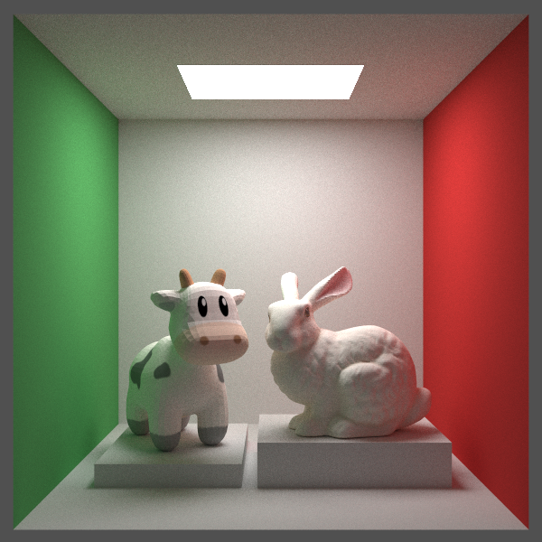

# README

A Renderer is based on ray tracing.

## How to use

### Run [CMakeLists.txt](CMakeLists.txt)

````shell
cmake -B build -DCMAKE_PREFIX_PATH="Path_TO_QT5"
cmake --build build
````
### Qt5

The UI is based on **Qt5**, so you must specific the the QT path.

### Example

If you don't want to use **Qt5** as the framework, just go to [example](./example) and run `run.sh` on **Linux OS**.

```shell
cd example
sh .\run.sh
```

### OpenMP

The Render is accelerated by **OpenMP**. Make sure your compiler support it.

## Result

### Cornell Box

<div align="center">
    
    <div style="">
        Figure : Cornell Box
    </div>
</div>

### Bunny and Spot Cow

<div align="center">
    
    <div style="">
        Figure : Bunny and Spot
    </div>
</div>

## Supported Features

- [x] Object:  sphere, rectangle, triangle and triangle-mesh 
- [x] Operation:  translation and rotation.
- [x] Material: diffuse reflection, specular reflection, refraction, participating media and light source
- [x] Texture: solid color, noise texture and image texture mapping
- [x] Advanced Sampling: BRDF sampling, light sampling, NEE, multiple importance sampling
- [x] Acceleration:
  - [x] BVH
  - [x] CPU Parallel: OpenMP
  - [x] GPU Parallel: CUDA
- [ ] Cook-Torrance BRDF
- [ ] Ray-Marching in volume rendering


## Reference

- [Ray tracing in one week](https://raytracing.github.io/)
- [PBRT3](https://pbr-book.org/3ed-2018/contents)
- [Scratchapixel 3.0](https://www.scratchapixel.com/index.html)